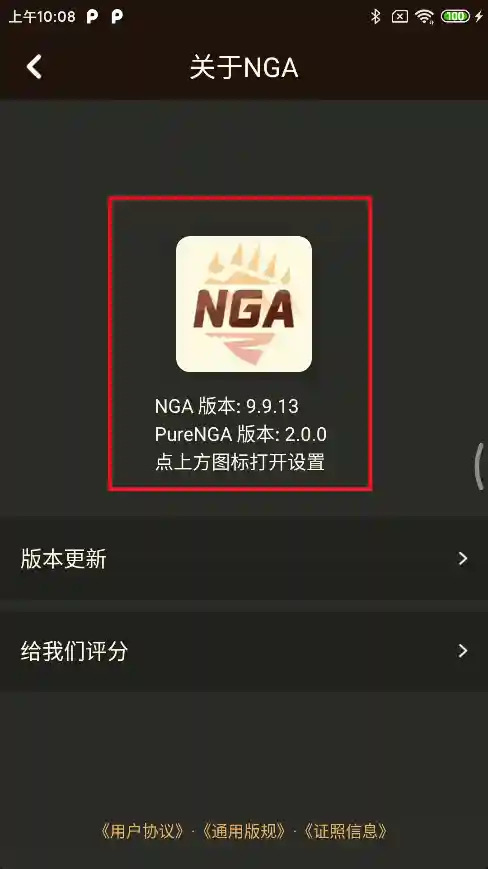
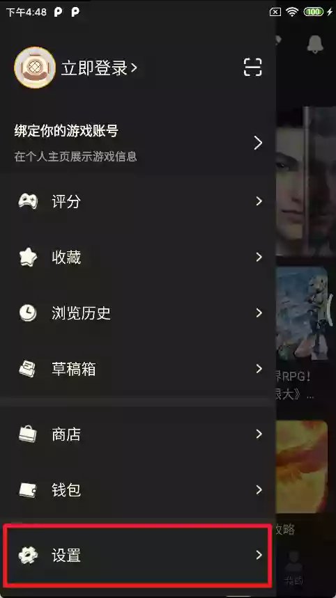
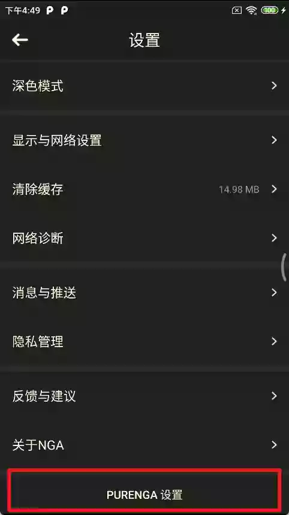

# PureNGA

[][repo_code]
[][repo_code]
[源码仓库][repo_code]

[][repo_xposed]
[][repo_xposed]
[Xposed 仓库][repo_xposed]

## 版本说明

|     类型     |                    特性                    |                  发行版链接                   |                     下载量                     |
| :----------: | :----------------------------------------: | :-------------------------------------------: | :--------------------------------------------: |
|  NGA 净化版  | 无需 Xposed 框架, 覆盖安装原版 App, 体积大 |    [![img][release_bundled]][link_bundled]    |    [![img][download_bundled]][link_bundled]    |
| 独立净化模块 |     依赖 Xposed 框架, 独立更新, 体积小     | [![img][release_standalone]][link_standalone] | [![img][download_standalone]][link_standalone] |

## 捐赠

## 主要功能

- [x] 开屏广告跳过
- [x] 信息流广告过滤
- [x] 去广告任务破解
- [x] 屏蔽更新检测
- [x] 屏蔽内置浏览器
- [x] 假装分享
- [x] 自定义首页

同时兼容 Lspatch, 支持 9.x.x 版本的 NGA 客户端

## 设置菜单入口

1.16.0 以后支持从关于页打开插件菜单

|  |  |
| -------------------------------------------------- | -------------------------------------------------- |

全版本通用插件设置菜单位置

|  |  |
| ------------------------------------------------- | -------------------------------------------------- |

---

[repo_code]: https://github.com/chr233/PureNGA
[repo_xposed]: https://github.com/Xposed-Modules-Repo/com.chrxw.purenga
[release_bundled]: https://img.shields.io/github/v/release/chr233/PureNGA?logo=github&label=版本
[release_standalone]: https://img.shields.io/github/v/release/Xposed-Modules-Repo/com.chrxw.purenga?logo=github&label=版本
[download_bundled]: https://img.shields.io/github/downloads/chr233/PureNGA/total?logo=github&label=下载
[download_standalone]: https://img.shields.io/github/downloads/Xposed-Modules-Repo/com.chrxw.purenga/total?logo=github&label=下载
[link_bundled]: https://github.com/chr233/PureNGA/releases/tag/NGA
[link_standalone]: https://github.com/Xposed-Modules-Repo/com.chrxw.purenga/releases
